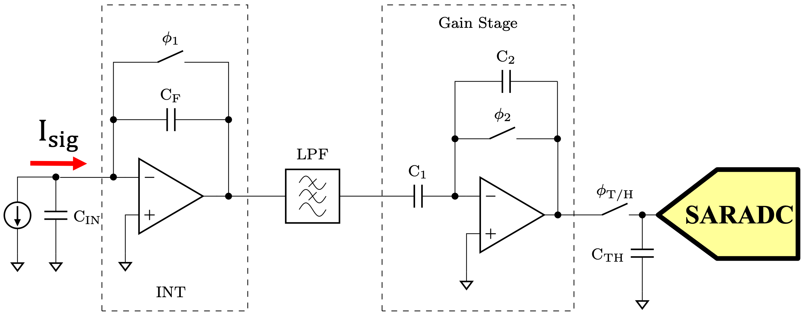

# Low-Noise pA Range Current Detector

Custom integrated circuit developed for the IEEE SSCS Supported Chipathon Project.

### Core Detector Layout

## SkyWater 130nm Tapeout Completed

### Core Detector Layout

### Full Chip Layout

## Project Overview

Designed a low-noise picoampere-range current detector in SkyWater 130-nm CMOS technology for ultra-low current sensing applications.

## Key Highlights

- pA-range current detection
- Low-noise analog front-end
- Custom IC implementation
- Full physical layout
- Tapeout completed

## Responsibilities

- System architecture
- Analog circuit design
- Schematic capture
- Layout implementation
- Verification
- Tapeout preparation

## Technology

SkyWater 130nm CMOS

## Tools
Open source tools: 
Xscheme | Magic | Ngspice | Klayout
