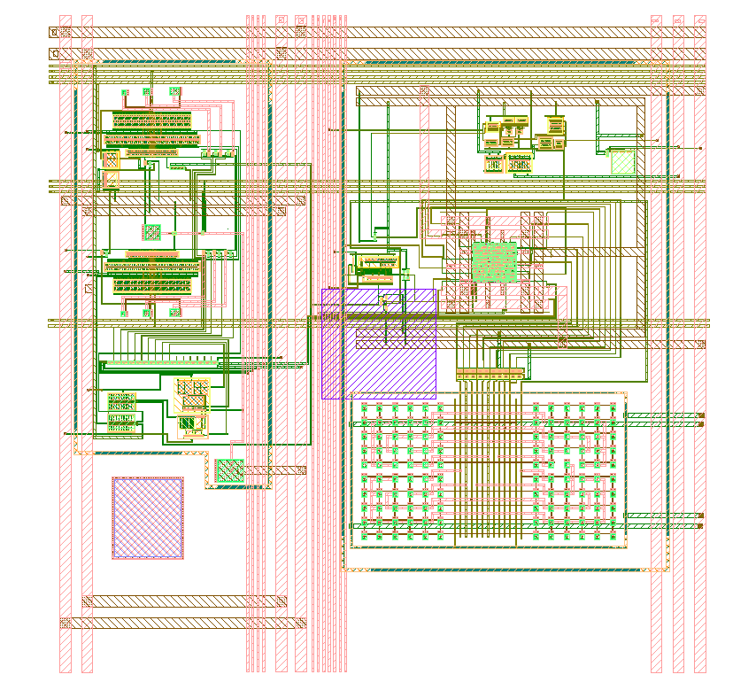
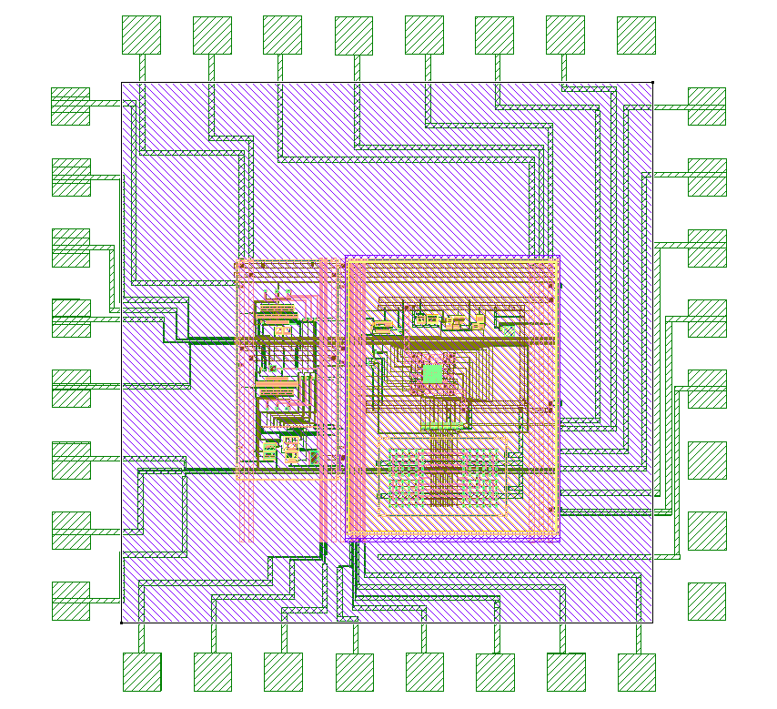

# Low-Noise pA Range Current Detector Array

Custom integrated circuit developed for the IEEE SSCS Supported Chipathon Project.

## SkyWater 130nm Tapeout Completed

### Core Detector Layout

### Full Chip Layout

## Project Overview

Designed a low-noise picoampere-range current detector array in SkyWater 130-nm CMOS technology for ultra-low current sensing applications.

## Key Highlights

- pA-range current detection
- Low-noise analog front-end
- Multi-channel detector array
- Custom IC implementation
- Full physical layout
- Tapeout completed

## Responsibilities

- System architecture
- Analog circuit design
- Schematic capture
- Layout implementation
- Verification
- Tapeout preparation

## Technology

SkyWater 130nm CMOS

## Tools

Cadence Virtuoso | Analog IC Design | Custom Layout
